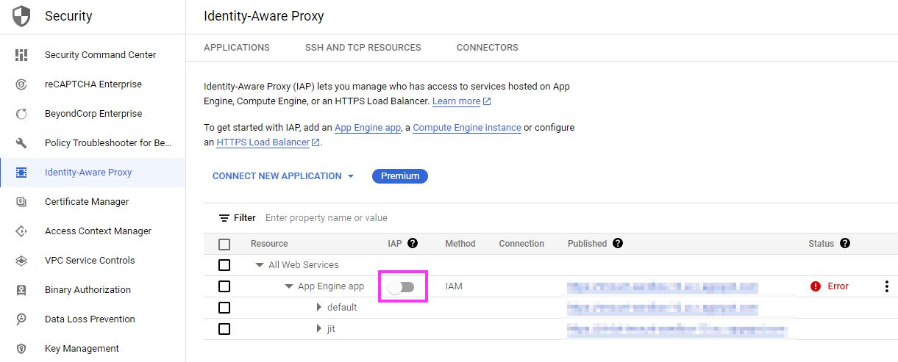
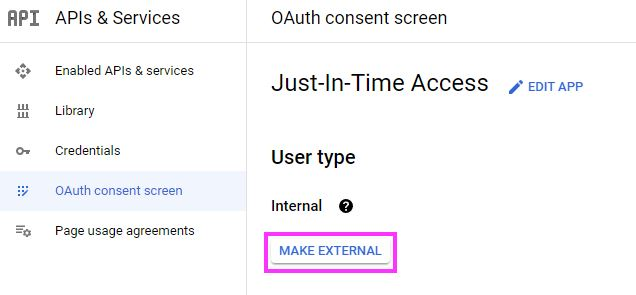
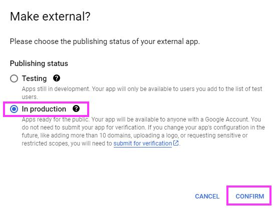
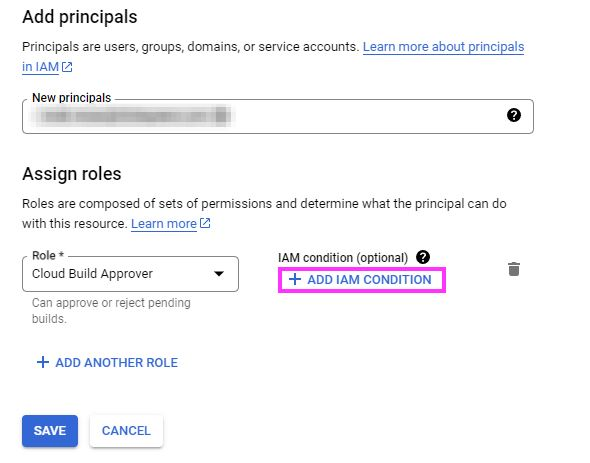
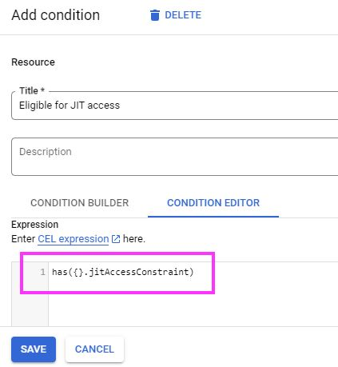

# Google Cloud Just-In-Time Access Provisioning Module
This module deploys the infrastructure needed for just-in-time privileged access management in Google Cloud. The resources/services/activations/deletions that this module will create/trigger are:

- Create an AppEngine application
- Create a Cloud Storage bucket for AppEngine source content
- Enable the OAuth consent screen for the AppEngine project
- Download and package the [Just-in-Time Access application](https://github.com/GoogleCloudPlatform/jit-access)
- Deploy an empty default service to AppEngine
- Deploy the Just-in-Time Access application to AppEngine

## Requirements

The system running Terraform must have these tools installed
- git
- zip

## Usage
- Reference: https://cloud.google.com/architecture/manage-just-in-time-privileged-access-to-project 
- Complete steps under ["Before you begin"](https://cloud.google.com/architecture/manage-just-in-time-privileged-access-to-project#before-you-begin)
  1. Determine what scope you want to deploy Just-in-Time Access for (project, folder, or organization)
  2. Grant appropraite access to the user or service account completing the deployment
  3. Create a Google Cloud project for the deployment
- Use this module to deploy Just-in-Time Access Provisioning to AppEngine
- These steps must be completed manually because they are not available via an API
  - Enable [IAP](https://console.cloud.google.com/security/iap) for the service
    - 
  - If required, change the [OAuth consent screen](https://console.cloud.google.com/apis/credentials/consent) **User type** to **External**
    1. 
    2. 
  - If required, grant access to the Service Account to resolve group membership information from your [Cloud Identity or Google Workspace account](https://cloud.google.com/architecture/manage-just-in-time-privileged-access-to-project#grant_access_to_allow_the_application_to_resolve_group_memberships)
- Enable access to the Just-in-Time Access application
  - Grant the **IAP-secured web app user** Role
    - Lets users open the Just-In-Time Access application, but does not provide them access to any additional resources yet
- Grant access to resources following your standard process, only adding the  `has({}.jitAccessConstraint)` condition
  1. 
  2. 

<!-- BEGIN_TF_DOCS -->

## Providers

| Name | Version |
|------|---------|
|  [google](#provider\_google) | 4.62.1 |
|  [null](#provider\_null) | 3.2.1 |
|  [random](#provider\_random) | 3.5.1 |

## Inputs

| Name | Description | Type | Default | Required |
|------|-------------|------|---------|:--------:|
|  [gcs\_bucket\_location](#input\_gcs\_bucket\_location) | n/a | `string` | `"US-CENTRAL1"` | no |
|  [iap\_support\_email](#input\_iap\_support\_email) | n/a | `string` | n/a | yes |
|  [jit\_deployment\_env\_variables](#input\_jit\_deployment\_env\_variables) | Reference: https://github.com/GoogleCloudPlatform/jit-access/wiki/Configuration | `map` | <pre>{   "ELEVATION_DURATION": "60",   "JUSTIFICATION_HINT": "Bug or case number",   "JUSTIFICATION_PATTERN": ".*" }</pre> | no |
|  [jit\_deployment\_project](#input\_jit\_deployment\_project) | n/a | `string` | n/a | yes |
|  [jit\_deployment\_region](#input\_jit\_deployment\_region) | n/a | `string` | n/a | yes |
|  [jit\_deployment\_type](#input\_jit\_deployment\_type) | One of "appengine" or "cloudrun". | `string` | `"appengine"` | no |
|  [jit\_deployment\_version](#input\_jit\_deployment\_version) | n/a | `string` | `"v1"` | no |
|  [jit\_sa\_description](#input\_jit\_sa\_description) | n/a | `string` | `"Just-In-Time Access"` | no |
|  [jit\_sa\_display\_name](#input\_jit\_sa\_display\_name) | n/a | `string` | `"Just-In-Time Access"` | no |
|  [jit\_sa\_name](#input\_jit\_sa\_name) | n/a | `list(string)` | <pre>[   "jitaccess" ]</pre> | no |
|  [jit\_scope](#input\_jit\_scope) | One of "projects", "folders" or "organizations". | `string` | n/a | yes |
|  [jit\_scope\_id](#input\_jit\_scope\_id) | project id, folder id, or organization id depending on the jit\_scope being applied | `string` | n/a | yes |
|  [provisioner\_interpreter](#input\_provisioner\_interpreter) | 'sh' for Linux(default), 'cmd' for Windows | `string` | `"sh"` | no |

## Outputs

No outputs.
<!-- END_TF_DOCS -->